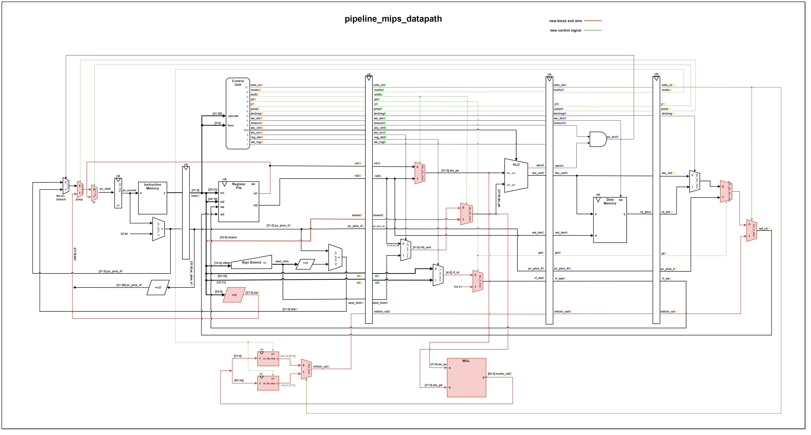

# MIPS Pipeline Processor

**Pipelined 32-bit MIPS CPU with Memory-Mapped I/O, Factorial Accelerator, and GPIO Integration**  
*Developed at San Jose State University — Spring 2021*  
**Team Lead:** Zhaoqin Li

---

## 📌 Overview

This project implements a custom **5-stage pipelined 32-bit MIPS processor** with support for R-type, I-type, and J-type instructions, extended to handle:

- `multu`, `mfhi`, `mflo`, `jr`, `jal` (custom logic and control signals)
- Memory-mapped **factorial accelerator** module
- Memory-mapped **GPIO interface**
- Modular **System-on-Chip (SoC)** design deployable on FPGA

---

## 🧠 Features

- **5-Stage Pipeline:** IF, ID, EX, MEM, WB stages with pipeline registers
- **Hazard Handling:** Support for jump, branch, and data hazards
- **Custom Instruction Support:**  
  - `multu` for unsigned multiply  
  - `mfhi` / `mflo` for accessing high/low result  
  - `jr` / `jal` for return address and function jumping  
- **Memory-Mapped I/O:**  
  - Address decoder for GPIO and factorial accelerator  
  - Modular expansion via base/target address mapping  
- **Hardware Modules:**  
  - **Factorial Accelerator**: Computes n! from memory-mapped input  
  - **GPIO Interface**: Two input and output ports for external data display  
- **Simulation-Driven Verification:**  
  - Testbenches for GPIO, factorial unit, and top-level MIPS SoC  
  - Validated inputs `n = 1 → 12`, including 12! = `479001600` (0x1C8CFC00)

---

## 🧪 System Architecture



---

## 📁 Repository Structure

```
.
├── src/                          # Verilog source files
├── pipeline_mips_project_Report.pdf  # Detailed design report
├── pipeline_mips_datapath.png        # Full datapath schematic
├── pipeline_mips_datapath.drawio     # Editable schematic source
```

---

## 🛠️ Technologies

- **Verilog HDL**
- **FPGA Design**
- **Memory-Mapped I/O**
- **MIPS ISA**
- **ModelSim / Vivado Simulation**

---

## 🚀 How to Use

1. Clone the repo and open the `.drawio` or `.png` files to view architecture.
2. Use your Verilog simulation environment (e.g., ModelSim, Vivado) to:
   - Compile all modules in `src/`
   - Run provided testbenches (see `tb_mips_top`) for full SoC functionality
3. Deploy to FPGA if needed (tested on Digilent board).

---

## 📄 Authors

- **Zhaoqin Li** — System Architecture & Integration Lead  
- Zhongling Ye  
- Ryota Suzuki  
- Tien Tran
